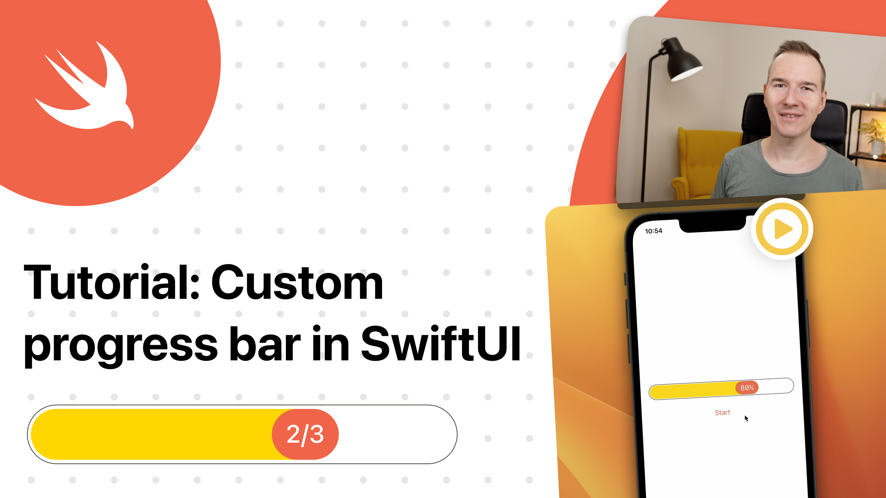

# Create an animated custom progress bar in SwiftUI

This is a code from the YT tutorial on how to Create an animated custom progress bar in SwiftUI 🤗

You will learn how to use ZStack, fixedSize and more tricks in the SwiftUI. Enjoy 🤓

## Links:
- [Link to the video](https://www.youtube.com/watch?v=8pMx1rmU5Ig)
- [ZStack](https://developer.apple.com/documentation/swiftui/zstack)